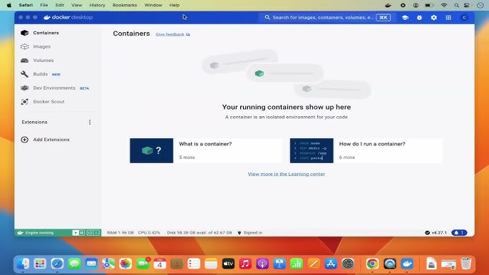

# Spatial AI
## System Requirement
The MIRTE ROS packages are developed and tested on Ubuntu 22.04 with ROS Humble and Gazebo Classic.

There are two modes for MIRTE Master development, i.e.:
- Simulation mode uses the Gazebo simulator;
- Real-robot mode connects the host device (your computer) with the physical MIRTE master.

The simulation mode has more requirements for the original host system as we can setup the environment using Docker or Virtual Machine, which the real-robot mode strictly requires a native Ubuntu22.04 or running the Docker/VM on a Linux host.

Instructions to setup the dev environment on various OS are provided below:
- [Windows / Linux](##docker-installation-for-windows-and-linux)
- [MacOS](#virtual-machine-for-macos)


## Docker Installation for Windows and Linux

### Windows Installation

Follow the instructions on the [docker website](https://docs.docker.com/desktop/setup/install/windows-install/) to install Docker Desktop. Please note that the Docker Installer must be ran as admistrator.

If you get the error The docker client must be run elevated to connect. Delete the C:/ProgramData/DockerDesktop and run the installer again as administrator. 

Once installed follow the tutorial on how to run your first image. Once you finish the tutorial, follow the same steps to build the Dockerfile available on Brightspace.



Once that has finished building follow the instructions below to install and build the relevant Mirte Packages inside of the docker.

### Installation on Mac/Linux
Follow the instructions on the [docker website](https://docs.docker.com/desktop/setup/install/) to install Docker for [Mac](https://docs.docker.com/desktop/setup/install/mac-install/) or [Linux](https://docs.docker.com/desktop/setup/install/linux/). If you encounter any premission issues on Mac please check out the [premission requiremnts](https://docs.docker.com/desktop/setup/install/mac-permission-requirements/#permission-requirements).

### Creating Docker Images
**Create a project folder on host:**
- For Linux/Mac users with `mkdir -p ~/spatial-ai/ws`
<!-- ```bash
mkdir -p ~/mirte_dev/ws/src
cd ~/mirte_dev
``` -->

- For Windows users
Create a folder named `spatial-ai` in any location of you chose and create a folder call `ws` within `spatial-ai`.

**Prepare the `Dockerfile` and the `docker-compose.yml`**
A text-based file named `Dockerfile` provides instructions to the image builder to create a container image. The file named `docker-compose.yml` defines your running containers, which is very practical if you have to re-run your container during development.
Please download these two files from Brightspace and place them in the `spatial-ai` folder.
<!-- >[!info]
>`notwork_mode: host` is important for ROS 2 discovery and for talking to the physical robot more easily.
>For simulation GUI, the X11 socket mount is the usual Linux approach. -->

### Build and Run the container
Open a terminal (or cmd on Windows). **Change the current directory to `spatial-ai`.** Then you can build and run the container:
```bash
docker compose build
docker compose run --rm mirte-dev
```
After the first creation, you can enter the container (from different terminal/cmd) with:
```bash
docker compose up -d
docker exec -it mirte-dev bash
```

### Install the MIRTE ROS packages inside the container
Inside the container:
```bash
cd /workspaces/mirte_ws/src
git clone https://github.com/mirte-robot/mirte-gazebo  
vcs import . < mirte-gazebo/sources.repos
```
That mirrors the MIRTE simulation instructions, which say to clone `mirte-gazebo` and then import the repositories listed in `sources.repos`.

<!-- *Optional cleanup for simulation mode*, exactly as in the MIRTE docs:
```bash
cd /workspaces/mirte_ws/src/mirte_ros_packages  
rm -rf mirte_bringup/ mirte_telemetrix_cpp/ mirte_teleop/ mirte_test/ mirte_zenoh_setup/
cd /workspaces/mirte_ws
```
MIRTE documents this as an optional speed-up if you do not need those packages and have no changes there. -->

<!-- Navigate to the `src` directory:
```bash
cd /workspaces/mirte_ws/src
``` -->
You should now see three folders under `src`, namely `gazebo_grasp_fix`, `mirte-gazebo`, and `mirte-ros-packages`. `cd` to each folder and run the following command to get the submodules:
```bash
git submodule init && git submodule update && git submodule update --init --recursive
```
Install dependencies and build:
```bash
sudo apt update
source /opt/ros/humble/setup.bash
rosdep install --from-paths src --ignore-src -r -y
colcon build --symlink-install
source install/setup.bash 
```
Those are the same build steps from the MIRTE docs.

## Virtual Machine for MacOS
The chips used in lastest Apple computers are `arm64`, while the binary Gazebo installation above is compiled for `amd64` (architecture of intel chips). The above Docker setup does not work for Mac -- Gazebo and Rviz fail to start. Thus, we provide Mac users with a fully configured Virtual Machine.

For this purpose, you first need to install UTM on your Mac. Then download and unzip this [file](https://surfdrive.surf.nl/f/18434905469), for which you need **at least 35 GB free space** in your Mac.

Then, import the `.utm` file by either double-clicking it or dragging it into UTM.

The login password is the same as the username. Once you login, open a teminal and run
```bash
cd ~/ws
source install/setup.bash
```


## Get started
We recommend testing first in simulation before driving the real MIRTE.

### MIRTER Master in simulation
```bash
cd <your mirte-workspace>
source /opt/ros/humble/setup.bash
source install/setup.bash
```
Then you can follow the instructions in [MIRTE Master docs](https://docs.mirte.org/develop/doc/simulation/mirte_master_gazebo.html) to play with the robot in Gazebo.

### Connecting MIRTE Master
TBA
