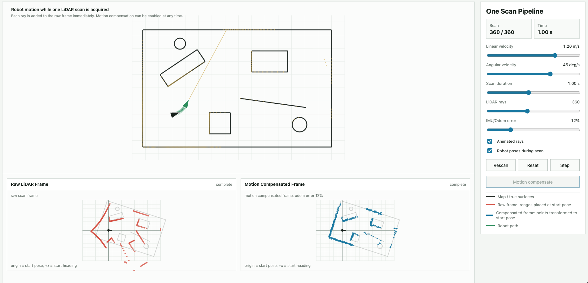
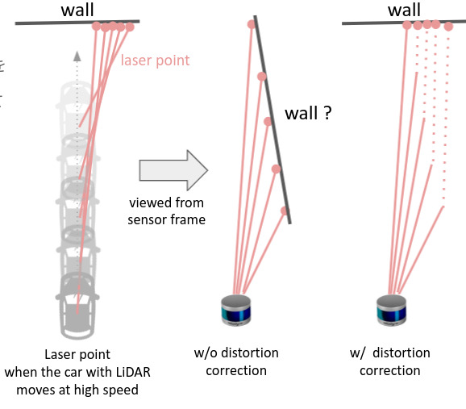

# LiDAR Motion Compensation Visualizer

This is a small tutorial for understanding LiDAR motion distortion and motion compensation.

Open the `index.html` locally or [Online website](https://lidar-motion-compensation-visulizat.vercel.app/) have fun!



## 1. Why LiDAR Scans Can Be Distorted

A rotating LiDAR does not capture the whole frame at one instant.

Instead, it sends out laser rays one by one while the sensor is rotating:



```text
ray 1   -> measured at t0
ray 2   -> measured slightly later
ray 3   -> measured slightly later
...
ray 360 -> measured at the end of the scan
```

If the robot is standing still, this is fine. All points are measured from the same robot pose.

But if the robot is moving while the LiDAR is scanning, different points in the same LiDAR frame are measured from different robot poses. If we ignore this and pretend all points were captured at the start pose, the final point cloud becomes distorted.

This is why motion compensation is needed.

## 2. What This Web Demo Does

This demo simulates a robot moving inside a 2D scene while taking one full LiDAR scan.

You can control:

- the robot linear velocity
- the robot angular velocity
- the total number of LiDAR rays
- the scan duration for one full LiDAR frame
- the IMU/odometry error level

During the scan, the robot moves and fires LiDAR rays one by one. The raw LiDAR frame is built in real time.

Try changing the speed, angular velocity, scan time, and ray count. Then compare the raw LiDAR frame with the motion compensated frame.

Open the demo:

```text
index.html
```

## 3. How Motion Compensation Works

The basic idea is simple.

For each LiDAR point, we need to know the robot pose at the exact time that point was measured.

Usually this pose information comes from:

```text
IMU
wheel odometry
visual odometry
LiDAR odometry
GNSS/INS
```

Suppose the scan starts at pose `T0`.

One LiDAR point is measured later, when the robot is at pose `Ti`.

Without motion compensation, we incorrectly place that point as if it was measured at `T0`.

With motion compensation, we use the relative transform between `Ti` and `T0` to transform the point back into the start-of-scan coordinate frame.

Conceptually:

```text
point measured at time i
        +
robot pose at time i
        +
start pose of scan
        ↓
transform point back to start pose
        ↓
motion compensated point
```

In this demo:

- the red frame is the raw LiDAR frame without motion compensation
- the blue frame is the motion compensated frame
- both frames use the scan start pose as the coordinate origin

## 4. IMU/Odom Error

Motion compensation depends on the quality of the pose estimate.

In real systems, IMU and odometry are not perfect. They can contain:

- IMU noise
- IMU bias
- wheel slip
- time synchronization error
- calibration error between LiDAR and IMU
- inaccurate velocity estimation

Because of this, motion compensation may not be perfect.

This demo includes an `IMU/Odom error` slider from `0%` to `50%`.

At `0%`, the compensation uses perfect pose estimates.

As the error increases, random pose error is added to the simulated IMU/odom estimate. You can see how bad pose estimation affects the final motion compensated LiDAR frame.

## 5. More Advanced Methods

Classical motion compensation usually depends on IMU/odom data.

More advanced methods can also use an existing map or reference point cloud. Instead of only trusting IMU/odom, they try to align the distorted LiDAR scan with a map and estimate the motion correction from that matching process.

One example is VICET:

https://github.com/mcdermatt/VICET

VICET uses a reference point cloud or HD map and tries to match the current distorted LiDAR scan to it. During this matching, it estimates both:

- the rigid pose of the scan relative to the map
- the motion distortion correction inside the scan

So this demo explains the basic intuition first: a LiDAR frame is built ray by ray while the robot moves. VICET and similar methods go further by using map matching to estimate or improve the motion correction.

